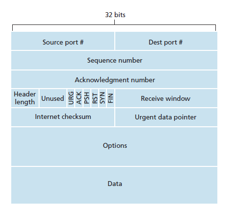

# Livello trasporto

Servizi offerti dal livello trasporto: 
1. Multiplexing e demultiplexing
1. Comunicazione end-to-end
1. Controllo di congestione (traffico rete)
1. Controllo di flusso (traffico nodo destinatario)
1. Nessuna garanzia su banda / ritardi:
	* È a commutazione di pacchetto, non a commutazione di circuito

## Protocolli di livello 4
* **TCP**
* **UDP**

## Multiplexing e demultiplexing
```
0              16           31
+-------------+------------+
| Source port | Dest. port |  <=  Comuni a TCP e UDP
+-------------+------------+
:                          :
.    Altri campi header    .
:                          :
+--------------------------+
|                          |
|         Payload          |
|                          |
+--------------------------+
```

* Livello trasporto aggiunge porta sorgente e destinazione
* I flussi vengono multiplati/demultiplati grazie al numero di porta
* **Socket**:
	* Interfaccia tra due processi in rete
	* Coppia (IP, # porta)
* **UDP**
	* Flusso half-duplex
	* In ricezione UDP inoltra payload verso processo in ascolto su quella porta
- **TCP**
	* Flusso full-duplex
	* In ricezione TCP inoltra payload verso processo in ascolto su porta destinazione + socket sorgente

## UDP
* Servizio best effort:
	* Trasferimento inaffidabile
		* I pacchetti possono andare persi
	* Trasferimento non ordinato
		* I pacchetti possono arrivare fuori sequenza
	* Affidabile quanto IP
	* Nessun controllo di flusso / congestione
* Connectionless

### Segmento UDP
```
0              16           31
+-------------+------------+
| Source port | Dest. port |
+-------------+------------+
|   Length    |  Checksum  |
+-------------+------------+
|                          |
|         Payload          |
|                          |
+--------------------------+
```

**NB**: Il multicast/broadcast è possibile solo con UDP. Con TCP non posso mantenere informazioni di stato per ogni host per poter effettuare controllo di flusso/sequenza.

## TCP
* Point-to-point
* Trasferimento affidabile e in ordine
* Controllo di flusso / congestione
* Connection-oriented (handshake)

### Segmento TCP

* **Sequence number**:
	* Offset corrente in byte
	* Rispetto all'inizio dello stream
	* Inizializzato a numero casuale
* **ACK number**:
	* Prossimo *sequence number* che il ricevitore si aspetta
	* Cumulativo
	* Possibilità di *piggyback*
* **Flag**:
	* **ACK**: *ACK number* valido?
	* **SYN**: Apertura connessione
	* **FIN**: Chiusura connessione
* **Receive window**: Per controllo flusso
* **Opzioni**:
	* **MSS** (Maximum Segment Size)

**NB**: I segmenti ricevuti fuori sequenza possono essere scartati o meno, implementazione libera.
		
## Funzionamento lato trasmettitore
1. Crea segmento con `seq #` adeguato
1. Invia segmento
1. Fa partire timer se non c'è già altro timer
	* Timer sull'ultimo segmento unacked
1. Se timeout:
	1. Ritrasmette segmento che l'ha causato
	1. Riavvia timer
1. Se riceve ACK:
	1. Effettua acknowledge
	1. Fa partire timer su segmento unacked più vecchio

## Funzionamento lato ricevitore (generazione ACK)
**Evento** => **Azione**

- Arriva segmento in ordine, segmenti precedenti tutti ACKed => 
	* ACK ritardato: aspetta altri segmenti per 500ms
	* Se non arriva niente manda ACK

- Arriva segmento in ordine, solo segmento precedente non ACKed =>
	* Manda subito ACK cumulativo per entrambi

- Arriva segmento fuori sequenza: `seq #` maggiore di quello che mi aspettavo, c'è gap =>
	* Invio ACK con `seq #` che mi aspettavo prima (*ACK duplicato*)
	* Es: aspettavo `#3`, arriva `#5` => invio di nuovo ACK `#3`

- Arriva segmento che completa gap parzialmente o totalmente (segmento che fa spostare la finestra) =>
	* Mando ACK

## Fast retransmit
* Tempi di timout relativamente lunghi
* Passa del tempo prima di ritrasmettere segmento perso
* Rilevo segmenti persi con i **tripli ACK duplicati**

**Funzionamento**
* Ricevo per 3 volte ACK duplicati (1 ACK "normale" + 3 duplicati)
* Probabilmente segmento perso
* Trasmetto subito segmento con `seq #` non ancora ACKed

## Scelta del timeout
* Il timeout dipende dall'RTT
* L'RTT varia =>
* Si stima l'RTT con una media mobile esponenziale:
	* L'influenza del passato decresce esponenzialmente

## Controllo di flusso
* Evita di sovraccaricare il nodo ricevitore
* Ogni ricevitore:
	* Ha un buffer
	* Spazio libero nel buffer di dimensione `rwnd`
	* Comunica al trasmettitore `rwnd` nel campo *receive window* dell'header TCP
* Trasmettitore adatta la sua finestra di trasmissione: `twnd<=rwnd`

## Gestione della connessione

### Apertura connessione
Meccanismo del **3-way handshake**:
* Negoziazione parametri
* Spesso definita anche come **SYN-SYNACK-ACK** per i flag settati


1. Client
	1. Sceglie randomicamente `Seq#=x`
	1. Manda un segmento **SYN** con:
		* `SYNbit=1`
		* `Seq=x`
		* Payload vuoto
1. Server
	1. Sceglie randomicamente `Seq#=y`
	1. Manda un segmento **SYNACK** con:
		* `ACKbit=1`
		* `SYNbit=1`
		* `ACK#=x+1` (piggybacking)
		* `Seq#=y`
		* Payload vuoto
1. Client
	* Manda un segmento **ACK** con:
		* `ACKbit=1`
		* `ACK#=y+1` (piggybacking)
		* `Seq#=x+1`
		* Payload eventualmente non vuoto
		
### Chiusura connessione
1. Host A
	1. Manda un segmento **FIN** con:
		* `FINbit=1`
		* `Seq#=x`
	1. Ha chiuso la sua connessione verso B: può solo ricevere
1. Host B
	1. Manda un segmento **ACK** con:
		* `ACKbit=1`
		* `ACK#=x+1`
	1. B può ancora trasmettere ad A
1. Eventualmente B trasmette dati ad A
1. Host B
	1. Manda un segmento **FIN** con:
		* `FINbit=1`
		* `Seq#=y`
	1. B non può più inviare dati ad A
1. Host A
	1. Manda un segmento **ACK** con:
		* `ACKbit=1`
		* `ACK#=y+1`

Ovvero la connessione viene chiusa in due fasi.

## Principi di controllo della congestione
* Si vuole evitare di sovraccaricare la rete
* Controllo di congestione a livello end-system:
	* Concetto di **finestra di congestione** della rete:
		* "Buffer" offerto dalla rete
		* Dedotta da ritardi e perdite

### Controllo di congestione TCP
Algoritmo **additive increase - multiplicative decrease** (**AIMD**)
* **Approccio**: Cerco di usare quanta più banda possibile, fino a quando non ci sono perdite
* Trasmettitore continua ad incrementare `cwnd` di 1 MSS per ogni RTT
* Se trasmettitore rileva perdita `cwnd/=2`

### TCP slow start
Nel caso di connessione TCP appena aperta:
* *Problema*: Arrivare alla `cwnd` "di picco" è lento con *AIMD*
* *Soluzione*: Algoritmo dello **slow start**:
	1. `cwnd=1` 
	1. Si raddoppia `cwnd` per ogni RTT (crescita esponenziale)
	1. Se avviene perdita:
		- **Dovuta a timeout**:
			* Segmenti persi / ACK persi
			* Congestione elevata
			* Reset: `cwnd=1`
			* Riprendo slow start
		- **3 ACK duplicati**:
			* Segmenti persi
			* Ricevo ancora gli ACK
			* Il traffico viaggia, ma si va verso la congestione
			* Situazione non grave
			* Dimezzo `cwnd`
			* Poi cresco linearmente => *AIMD*
* Slow start procede fino ad un certo **threshold**:
	* Threshold settato a `cwnd/2` quando avviene perdita

## Fairness
* TCP è un **protocollo fair**:
	* K connessioni TCP usano lo stesso canale
	* Il canale ha un collo di bottiglia a rate R
	* Tutte le connessioni vanno a R/K (mediamente)
* Nel caso di UDP, non essendoci controllo di congestione, "ruba" banda a TCP
