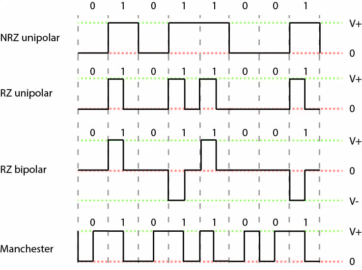

# I mezzi trasmissivi

## Parametri caratterisitici mezzi trasmissivi elettrici
* Impedenza
* Velocità di propagazione del segnale
* Attenuazione
* Diafonia

## Fibra ottica
* Filo di vetro in due parti: **core** (interno) e **cladding** (esterno)
	* Indici di rifrazione diversi
* Immunità ai disturbi elettromagnetici

## Radio (etere)
* **Canale radiomobile**: se RX o TX in movimento
* Segnali soggetti a:
	* **Fading**: <u>variazione rapida</u>, dovuta ad ostacoli mobili
	* **Shadowing** : <u>variazione lenta</u>, dovuta a ostacoli fissi

## Trasmissione sul mezzo fisico
*Obiettivo*: associare un segnale ad una certa informazione.\
*Due alternative*:
* Codifiche di linea
* Modulazioni digitali
	* *ASK*
	* *PSK*
	* *FSK*
	* *QAM*

### Codifiche di linea
* **Unipolari**: una sola polarità: tensione positiva per "1", nulla per "0"

* **Polari**: due polarità: 
	- **NRZ** (Non Return to Zero): passaggio da "0" a "1" senza passare da 0
	- **RZ** (Return to Zero): 
		* ritorno a zero prima di ogni bit
		* frequenza doppia
	- **Bifase**: 
		* caso **Manchester**, bit rappresentato da transizione di tensione da basso ad alto o viceversa
		* frequenza doppia

* **Bipolari**:
	* "0" con tensione nulla
	* "1" con tensione con polarità che si alterna (es. +5, -5)

* **nBmB**: 
	* rappresento simboli a `n` bit con simboli a `m` bit (`m>n`)
	* simboli che avanzano utili per sequenze speciali

## Reti di accesso e di trasporto
* **Rete di accesso**: apparati che collegano l'utente col nodo di accesso del gestore (ultimo miglio)
	* **DSL**:
		* Evoluta in **VDSL** (Very High Rate DSL)
		* Apparati lato ISP:
			* **POTS**: splittano dati e voce
			* **DSLAM**: multiplexer di segnali DSL
	* **PON**:
		* **Passive Optical Network**: fibre ottiche nell'ultimo miglio
		* **ONU** (Optical Network Units) in cabina stradale
	* **HFC**:
		* **Hybrid Fiber Coax**
		* Utlizzano infrastruttura TV via cavo
	* **Rete cellulare**
		* Molte antenne di portata limitata
		* **Roaming**: triangolazione utente
		* **Handover**: passare da una cella ad un'altra senza perdere connessione
* **Rete di trasporto**:
	* Interconnessione tra reti d'accesso
	* Tecnologie evolute dalla rete telefonica tradizionale
	* Basata su multiplazione gerarchica a divisione di tempo
	* Protocolli di trasporto:
		* **PDH**: quasi sincrono
		* **Sonet / SDH**:
			* evoluzione di PDH
			* sincrono
		* Sincronia => no store and forward
