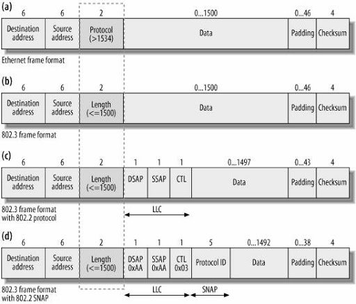

# Standard per reti locali

**Sottolivello MAC**:
* Indirizzamento locale (con indirizzi MAC)
* Delimitazione trama
* Rilevamento errore

## Ethernet e IEEE 802.3
**Novità**: se viene rilevata una collisione viene inviata una *sequenza di jamming*

### Differenze tra Ethernet e 802.3

1. Campo *EtherType* in Ethernet diventa *Length* in 802.3
	* In Ethernet *EtherType* > 1500
	* In 802.3 *Length* <= 1500
1. Dimensione campo dati:
	* In Ethernet da 46 a 1500 byte
	* In 802.3 vanno da 0 a 1500 byte (introdotto campo padding di 0-46 byte)

### Livello fisico
* Vincoli su durata trama e RTT impogono:
	1. Con ethernet originale:
		* Dimensione min trama di 64 B
		* Distanza max di 2800 m
	1. Con fastethernet:
		* Distanza max di 100m
	1. Con gigabit ethernet:
		* Aumentata dimensione min trama
		* Utilizza codifica 8B10B

### Switch
* Utilizza Store And Forward
* **LAN estesa**: LAN interconnessa tramite switch
* Annulla probabilità di collisioni => la rete diventa a commutazione di pacchetto

#### Transparent switching
- **Address learning**:
	* Creazione MAC table (MAC <=> port_id)
	* Timer di invecchiamento per ogni tupla
	* Utilizza algoritmo **backward learning** che funziona solo in assenza di anelli

- **Frame forwarding**:
	* Frame inoltrati sfruttando MAC table
	* Se indirizzo non presente in MAC table:
		1. Inoltra su tutte le porte (tranne quella di provenienza)
		1. Impara corrispondenza da risposta

- **Algoritmo spanning tree**:
	* Elimina anelli spegnendo determinate intefacce
	* Requisiti:
		1. switch_id per ogni switch nella rete
		1. Indirizzo multicast tra switch
		1. Costi associati ad ogni porta

## WIFI 802.11
* Architettura può essere:
	* **Con infrastruttura**
	* **Ad hoc**

###	Strato fisico
* Lavora su bande ISM

###	Strato MAC
* Protocollo accesso multiplo:
	* **DCF** (Distributed Coordination Function)
	* Basato su CSMA/CA:
		* TX e RX come in CSMA/CA
		* Aggiunta di **NAV** (Network Access Vector): tempo in cui gli altri evitano di trasmettere, perchè altra trasmissione già in corso
	* Stazioni half-duplex

### Problema del terminale nascosto
*Problema*:
* A e B a portata dell'AP
* A e B non a portata reciproca
* Se A o B trasmette l'altra sente comunque canale libero

*Soluzione*: **DFC con handshaking**
1. Stazione trasmette microtrama **RTS** (Request To Send) all'AP
	* Contiene durata trasmissione dati
1. AP risponde dopo SIFS con microtrama **CTS** (Clear To Send)
	* Coniente durata rimanente scambio (NAV)
1. Qualsiasi stazione (anche nascosta) sente il canale occupato e attende
