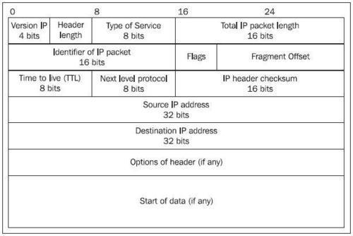

# Livello rete

## IP

Campi (più importanti):
* **Versione**: IPv4/v6
* **Header length**: necessario per **Options of header**
* **Type of service**: per QoS
* **Lunghezza totale**: del datagram
* **Time To Live**
* **Next level protocol**: TCP/UDP/ICMP
* **Header checksum**
* **Source IP address**
* **Destination IP address**

### Frammentazione e riassemblaggio
* Segmenti di rete diversi hanno **MTU** (Maximum Transmission Unit) diversi
* Pacchetti IP eventualmente frammentati dai router

### Campi modificati da un router
* TTL
* Checksum
* (Vedere NAT)

## Addressing

### Protocollo ARP
* A, noto l'IP di B, vuole conoscere il MAC di B
* Lavora sopra ad Ethernet
* <u>Non</u> lavora su IP

**Funzionamento**:
1. A invia **ARP Request**:
	* In broadcast
	* Contiene l'IP di B
1. B riceve **ARP Request**
1. B invia **ARP Reply** ad A:
	* Contiene il MAC di B

### Indirizzi IP riservati
* `subnet.0`: identifica la rete
* `255.255.255.255`: **limited broadcast**
	* Broadcast nella rete in cui sono
* `subnet.255`: **directed broadcast**
	* Broadcast in una rete qualunque
* `127.x.y.z`: **loopback**

### Metodi di addressing
- **Classful addressing**: 
	* Divisione dell'IP in base alla classe di appartenenza in :
		* *Parte network*
		* *Parte host*
	* Poco flessibile
- **Subnetting** (**VLSM**):
	* Suddivisione di una rete classful in più sottoreti
	* Concetto di subnet mask
- **Classless addressing** (**CIDR**):
	* Rimosso concetto di classi
	* Netmask separa parte network e host

### Classi riservate
* **Classe D**: indirizzi di multicast
* **Classe E**: per scopi futuri

## Routes di un router
Tre tipi di entry nella routing table:
- **Dirette**: reti direttamente connesse
- **Statiche**: inserite manualmente
- **Dinamiche**: inserite automaticamente (attraverso protocolli)

## DHCP (Dynamic Host Configuration Protocol)
* Basato su UDP

**Funzionamento**:
1. **DHCP discover**:
	* Dal client al server
	* **IP destinazione**: broadcast:67
	* **IP sorgente**: 0.0.0.0:68

1. **DHCP offer**:
	* Dal server al client
	* **IP destinazione**: broadcast:68
	* **IP sorgente**: server:67
	* **yiaddress**: IP proposto

1. **DHCP request**:
	* Dal client al server
	* Accettazione dell'IP proposto
	* **IP destinazione**: broadcast:67
	* **IP sorgente**: 0.0.0.0:68
	* **yiaddr**: IP accettato

1. **DHCP ACK**:
	* Dal server al client
	* Conferma ricezione *DHCP request*
	* **IP destinazione**: broadcast:68
	* **IP sorgente**: server:67
	* **yiaddr**: IP assegnato al client

## ICMP (Internet Control Message Protocol)
* Scambio di informazioni di controllo
* Lavora su IP
* Campi:
	* Tipo
	* Codice
	* Checksum
	* Primi 8 byte del pacchetto IP che l'ha generato
* Es. ping: echo request & echo reply
